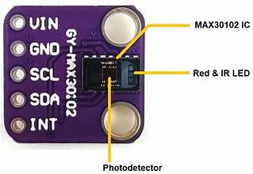
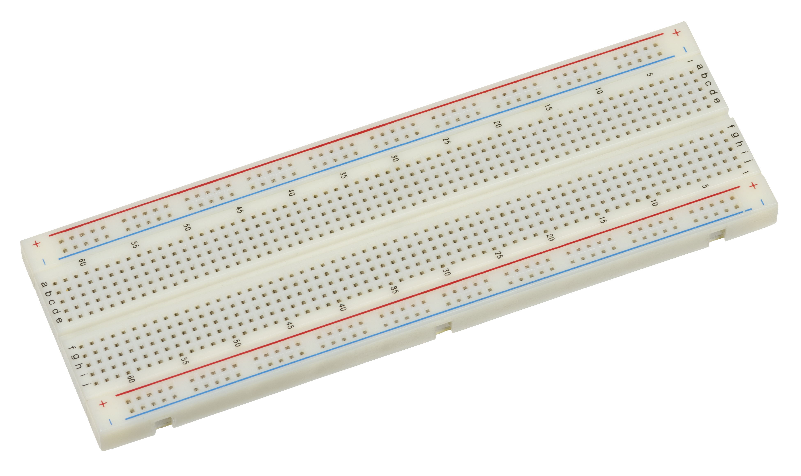
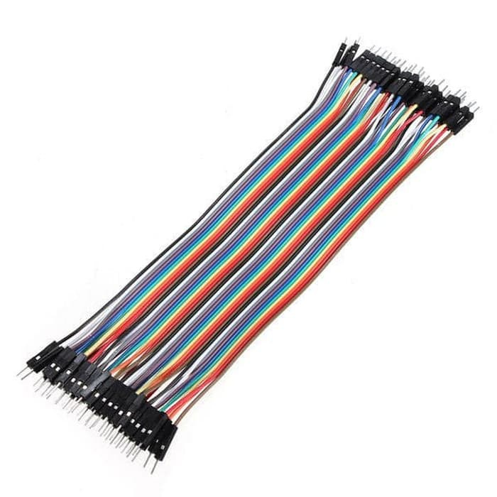
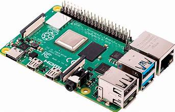

# Sistem Pemantauan dan Deteksi Kelelahan AIoT Integrasi Computer Vision dan Heart Rate Variability (HRV)

### Anggota Kelompok 3:
* Kelvin Krismora Gultom (5024231062)
* Hasna Widyaningrum (5024241004)
* Rahmat Maulana Anshori (5024241011)
* Lu'bah Al 'Aini (5024241082)

## Daftar Isi
1. [Latar Belakang](#1-latar-belakang)
2. [Deskripsi Proyek](#2-deskripsi-proyek)
3. [Alur Sistem](#3-alur-sistem)
4. [Alat dan Bahan](#4-alat-dan-bahan)
5. [Parameter Klinis dan Threshold Fisiologis](#5-parameter-klinis-dan-threshold-fisiologis)
6. [Struktur Topik MQTT (VPS Node)](#6-struktur-topik-mqtt-vps-node)
7. [Struktur Direktori](#7-struktur-direktori)
8. [Panduan Menjalankan Sistem (Execution Guide)](#8-panduan-menjalankan-sistem-execution-guide)

---

## 1. Latar Belakang

Kelelahan (fatigue) merupakan faktor penting yang dapat menurunkan produktivitas dan meningkatkan risiko kecelakaan kerja akibat penurunan kesadaran yang tidak terdeteksi sejak dini. Oleh karena itu, diperlukan sistem AIoT yang mengintegrasikan data visual melalui Computer Vision (Eye Aspect Ratio) dan data fisiologis melalui analisis HRV (Heart Rate Variability). Dengan protokol MQTT untuk transmisi data real-time ke VPS, sistem ini mampu memantau kondisi secara akurat serta memberikan peringatan otomatis melalui Telegram Bot.

## 2. Deskripsi Proyek

Sistem pemantauan kelelahan (*fatigue*) pengemudi real-time ini mengintegrasikan dua parameter validasi utama untuk mengukur tingkat kelelahan secara objektif:

* **Validasi Visual (Computer Vision):** Memetakan koordinat titik wajah (*facial landmark tracking*) secara real-time untuk menghitung pembukaan kelopak mata (*Eye Aspect Ratio*) dan mendeteksi aktivitas menguap (*Behavioral Fatigue Labeling*).
* **Validasi Fisiologis (Heart Rate Variability):** Mengukur fluktuasi detak jantung inter-beat interval dari pengemudi melalui sensor denyut nadi untuk meminimalkan risiko *false alarm* yang sering terjadi pada sistem berbasis kamera akibat variasi anatomi wajah pengemudi atau intensitas cahaya kabin.

Seluruh data dari lapisan *edge* dikirimkan menggunakan arsitektur ringan via protokol **MQTT (Mosquitto Broker)** ke server **VPS**. Di sisi server, data diproses dalam *machine learning pipeline* menggunakan algoritma **Random Forest Classifier** untuk menghasilkan keputusan klasifikasi akhir, yang kemudian divisualisasikan pada *Metabase Dashboard* serta memicu alarm darurat via *Telegram Bot* jika terdeteksi anomali kesadaran.

---

## 3. Alur Sistem

Sistem terdiri dari beberapa entitas perangkat keras: **ESP32** (membaca sensor fisiologis), **Raspberry Pi** (gateway/komunikasi lokal), **Laptop/PC** (edge processing untuk beban komputasi visi), dan **Cloud VPS** (pusat basis data, inferensi machine learning, dan manajemen aplikasi).

### Arsitektur Alur Data

### Detail Urutan Logika Sistem
1. **Ekstraksi Data Sensor:** ESP32 secara kontinu menangkap data detak jantung mentah dan meneruskannya ke Raspberry Pi. Kamera pada kabin menangkap visual wajah pengemudi.
2. **Pra-pemrosesan Edge:** Laptop melakukan kalkulasi visual (*facial landmarks*) untuk menentukan status kedipan lambat atau menguap, sedangkan Raspberry Pi memproses sinyal HRV.
3. **Ingest Data MQTT:** Data visual dikirim melalui topik `/status_cam`, data detak jantung dikirim melalui topik `/hrv`.
4. **Fusi Sensor & Inferensi AI:** Model Random Forest di VPS membaca kombinasi input visual dan fisiologis secara bersamaan untuk menentukan nilai akhir pada topik `/is_tired`.
5. **Aksi Aplikasi:** Data terekam di MySQL/PostgreSQL, Metabase memperbarui visualisasi dashboard, dan Telegram Bot mengirimkan pesan interupsi apabila status klasifikasi berada di luar batas aman.

---

## 4. Alat dan Bahan

### Tabel Komponen Perangkat Keras (Hardware)

Berikut merupakan komponen hardware aktual yang digunakan dalam proyek ini:

| No. | Nama Alat | Gambar Alat | Tipe / Spesifikasi | Penjelasan & Fungsi |
| :--- | :--- | :--- | :--- | :--- |
| 1 | **ESP32** |  | ESP32 DevKit V1 | Mikrokontroler utama yang bertugas membaca sinyal detak jantung dan mengirimkan data di level sensor node. |
| 2 | **Heart Rate Sensor** |  | MAX30102 | Sensor oksimetri pulsa berbasis I2C yang digunakan untuk melacak variabilitas detak jantung (HRV) secara presisi. |
| 3 | **Webcam Ugreen** |  | 1080p Full HD | Perangkat input visual untuk menangkap data wajah pengemudi demi keperluan pemrosesan Computer Vision. |
| 4 | **Breadboard** |  | MB-102 830 Point | Papan eksperimen yang digunakan untuk merangkai jalur pin sensor ke mikrokontroler tanpa proses penyolderan. |
| 5 | **Kabel Jumper** |  | Male-to-Male | Kabel penghubung fisik yang digunakan untuk mendistribusikan sinyal sinyal dan daya antar komponen elektronik. |
| 6 | **Kabel USB** |  | Micro USB / Type-C | Kabel koneksi untuk suplai daya perangkat atau transmisi data serial dari mikrokontroler ke gateway. |
| 7 | **Raspberry Pi** |  | Pi 4 Model B | Perangkat gateway lokal untuk menjembatani routing data sensor menuju server broker melalui skrip shell. |
| 8 | **Laptop / PC** | - | Edge PC | Unit komputasi lokal untuk menjalankan algoritma visual tracking dan melakukan publikasi pesan ke topik MQTT. |
| 9 | **VPS Node** | - | Cloud VPS Node | Pusat infrastruktur server jarak jauh untuk menjalankan broker MQTT, penyimpanan database, dan manajemen alert. |
### Perangkat Lunak (Software)
* **Arduino IDE:** Untuk mengompilasi dan mengunggah program firmware ke board ESP32.
* **Mosquitto MQTT Broker:** Berjalan pada VPS untuk mendistribusikan pesan dari edge layer ke subscriber internal.
* **Python 3.x:** Runtime utama yang mengeksekusi model deteksi wajah OpenCV/Dlib, pustaka manipulasi data (Numpy, Pandas), serta pustaka *Scikit-Learn* untuk *Random Forest Classifier*.
* **MySQL & PostgreSQL:** Basis data relasional yang digunakan di VPS untuk menyimpan rekaman log jangka panjang dari pengemudi secara terstruktur.
* **Metabase:** Platform visualisasi data open-source untuk menampilkan performa grafis metrik kelelahan secara real-time.
* **Telegram Bot API:** Layanan webhook untuk menyiarkan pesan peringatan dini ke perangkat pengawas atau pengemudi.

---

## 5. Parameter Klinis dan Threshold Fisiologis

Untuk mendeteksi penurunan kesadaran secara akurat, sistem mengombinasikan deteksi perilaku visual dengan pembagian ambang batas (threshold) denyut jantung klinis sebagai berikut:

* **Normal (Alert / Fokus): 85 - 95 BPM**
    Kondisi di mana **user** berada dalam tingkat kesadaran penuh. Detak jantung cenderung meningkat atau stabil dalam rentang ini karena adanya stimulasi kognitif dan konsentrasi tinggi saat beraktivitas.
* **Mengantuk (Drowsy): 75 - 82 BPM**
    Terjadi penurunan denyut jantung sekitar 10% dari kondisi baseline normal. Aktivitas sistem saraf parasimpatis mulai mendominasi, mengindikasikan **subjek** mulai kehilangan konsentrasi dan memasuki fase kelelahan awal.
* **Kritis (Hampir Tidur / Microsleep): < 70 BPM**
    Kondisi darurat di mana denyut jantung turun secara signifikan di bawah batas aman (kecuali bagi **individu** dengan riwayat kondisi fisik atlet). Berisiko tinggi memicu insiden akibat hilangnya kesadaran total dalam hitungan detik.
---

## 6. Struktur Topik MQTT (VPS Node)

Broker Mosquitto di Cloud VPS mengelola tiga topik utama yang dikirim secara simultan oleh subsistem edge untuk diolah oleh pipeline AI:

| Nama Topik | Tipe Data | Deskripsi Fungsi | Source Node |
| :--- | :--- | :--- | :--- |
| `/status_cam` | String / Boolean | Mengirimkan status deteksi kelelahan visual (misal: `0` untuk normal, `1` untuk mengantuk/menguap) berdasarkan hasil kalkulasi kelopak mata dan mulut oleh kamera. | Laptop Edge Computer |
| `/hrv` | Integer | Meneruskan data denyut jantung mentah yang dibaca dari sensor pulsa yang terikat pada mikrokontroler. | ESP32 via Raspberry Pi |
| `/is_tired` | String / JSON | Hasil keputusan final fusi sensor (kombinasi data `/status_cam` dan `/hrv`) yang telah dievaluasi oleh algoritma Random Forest Classifier di VPS. | Cloud VPS AI Engine |

---

## 8. Panduan Menjalankan Sistem (Execution Guide)

Ikuti urutan langkah-langkah di bawah ini secara runtut untuk memastikan seluruh komponen edge, gateway, dan cloud terhubung dengan benar.

### Langkah 1: Inisialisasi Lapisan Sensor (Hardware Edge)
1. Hubungkan sensor detak jantung ke pin analog input pada board ESP32 sesuai skema wiring.
2. Buka file `esp32_hrv.ino` menggunakan Arduino IDE, lakukan verifikasi port, kemudian unggah (*upload*) kode tersebut ke board mikrokontroler ESP32.
3. Pastikan perangkat menyala dan mulai membaca denyut nadi.

### Langkah 2: Konfigurasi Gateway Jaringan (Raspberry Pi Node)
1. Buka terminal pada laptop Anda, lalu masuk ke dalam sistem operasi Raspberry Pi menggunakan SSH melalui alamat IP lokal perangkat:
   ```bash
   ssh kelompok3@100.88.166.213
   ```
2. Jalankan skrip pemrosesan data HRV lokal:
      ```bash
      ./hrv.sh
   ```
3. Buka sesi terminal baru atau jalankan di background, kemudian eksekusi skrip streaming data untuk membuka jalur data ke broker luar:
      ```bash
      ./stream.sh
   ```
### Langkah 3: Menjalankan Pemrosesan Visual (Laptop Edge Computer)
1. Buka terminal lokal pada Laptop/PC yang terhubung ke webcam kabin.
2. Arahkan ke direktori project Anda:
